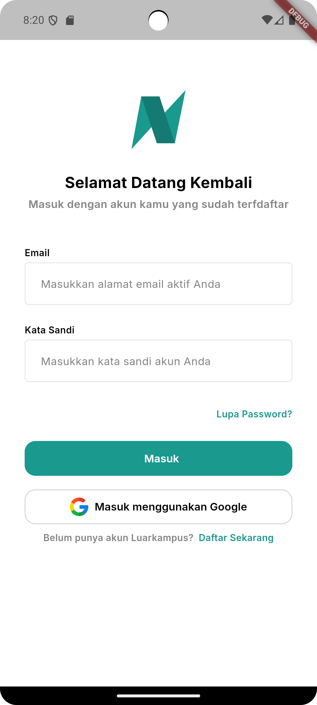
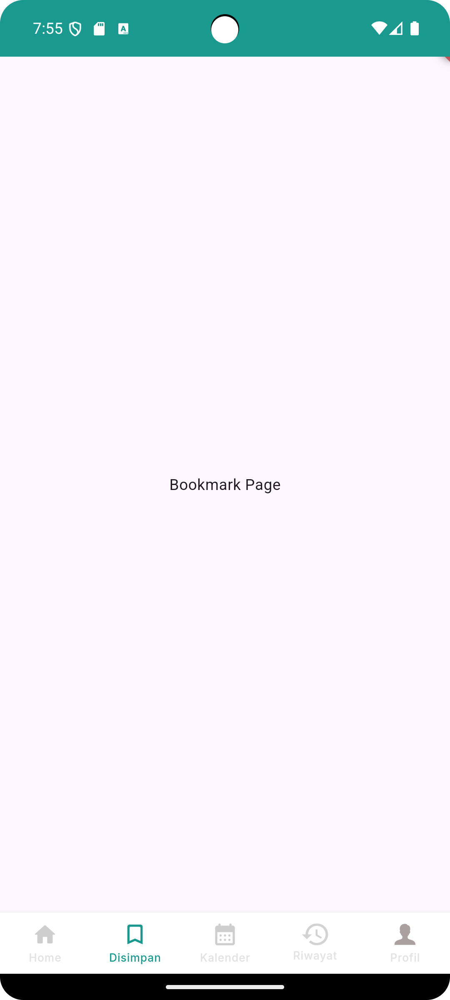

# 🚀 Starter Base Project

A ready-to-use template to kickstart Flutter application development with a complete feature set and modern structure.

## 🎯  About the Template

This template is designed to simplify Flutter app development. It includes:

    MVVM Architecture: Combined with state management using MobX.
    Dependency Injection: Managed via GetIt and Provider.
    Routing: Powered by AutoRoute for efficient route management.
    Internationalization (i18n): Supported by Easy Localization for multi-language support.
    Local Database: Uses ObjectBox for offline data storage.
    Responsive Layout: Built with Adaptive Class for responsive UI design.
    Model Class Generator: Powered by Freezed to auto-generate immutable models.
    HTTP Requests: Managed by Dio with integrated Alice logger.

    Pre-built Splash Page, Login Page, and Main Page with Bottom Navigation are included. You only need to customize them as per your requirements!

## 📁 Project Structure

Here is the folder structure of the project:

lib/
├── core/            // Contains global utilities and helpers
├── data/            // Includes local and remote data sources
├── models/          // Contains model definitions using Freezed
├── pages/           // UI pages of the application
├── routes/          // Route configurations using AutoRoute
├── store/           // State management with MobX
├── widgets/         // Reusable UI components
└── main.dart        // Application entry point

## 🚧 How to Use
### 1️⃣ Clone the Repository

git clone https://github.com/username/repository-name.git
cd repository-name

### 2️⃣ Install Dependencies

Ensure that Flutter SDK is installed. Run the following command to fetch all required packages:

flutter pub get

### 3️⃣ Run the Project

Run the project on an emulator or physical device:

flutter run

## ✨ Additional Features
### 🔄 Change Package Name

Use the change_app_package_name package to update the app's package name:

flutter pub run change_app_package_name:main com.yourcompany.yourapp

### 🖼️ Change App Icon

    Visit App Icon Generator.
    Upload your icon design and download the generated files.
    Replace the app icon files in the android/app/src/main/res/ and ios/Runner/Assets.xcassets directories.

### 📸 App Preview
#### 🔑 Login Page

#### 🏠 Main Page

(Attach a screenshot or GIF of the Main Page with Bottom Navigation.)
## 🎉 Why Use This Template?

    🌐 Multi-Language Support: Easily add new languages with Easy Localization.
    💾 Local Database: Quick integration with ObjectBox for offline data.
    📱 Responsive Design: UI adapts automatically to various screen sizes.
    🔌 Plug-and-Play: Ready to use without complicated configuration.

## 🛠️ Technologies Used

    Flutter SDK 3.0+
    Dio
    MobX
    Freezed
    AutoRoute
    Easy Localization
    ObjectBox

## 💡 Tips and Tricks

    Use Alice HTTP Logger to monitor all HTTP requests directly from the app.
    Separate your logic into dedicated files to maintain clean project structure.
    Leverage MobX for reactive state management.

## 🙌 Contributions

We welcome contributions from the community! To contribute, follow these steps:

    Fork this repository.
    Create a new branch:

    git checkout -b new-feature

    Submit a pull request to the main branch.

## 📄 License

This template is licensed under the MIT License. See the LICENSE file for more details.